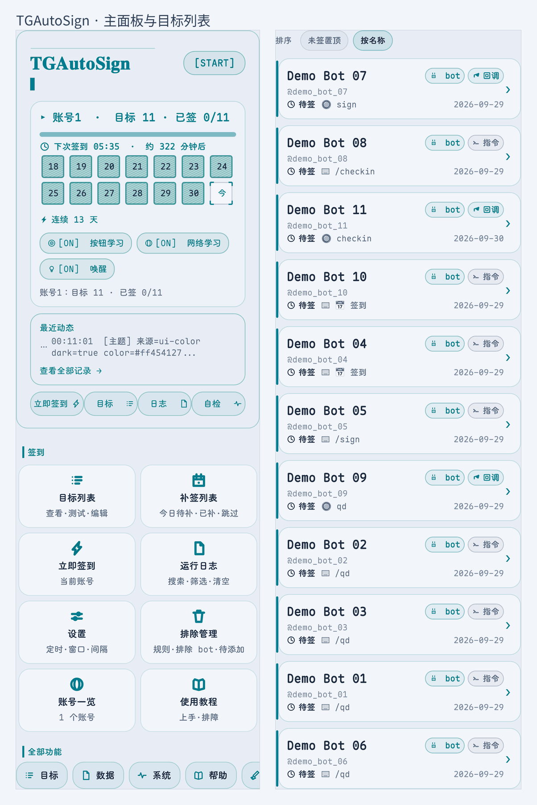
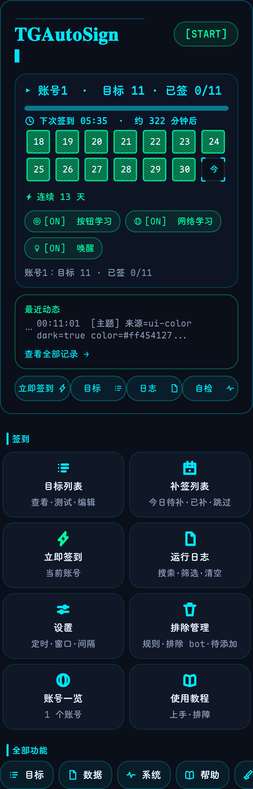
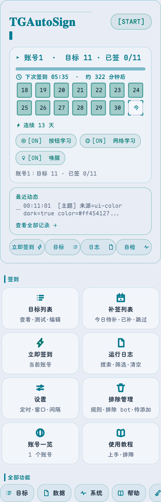
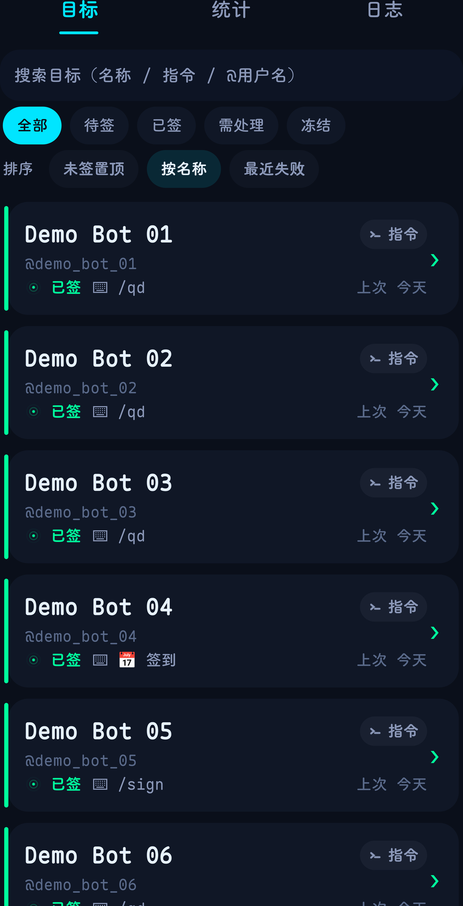
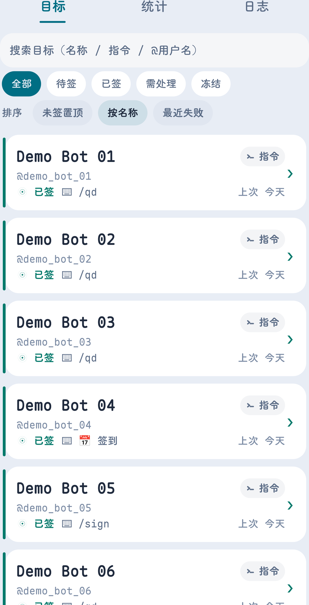
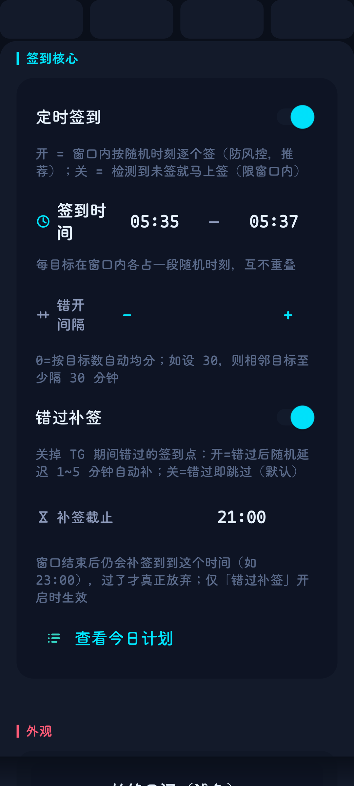
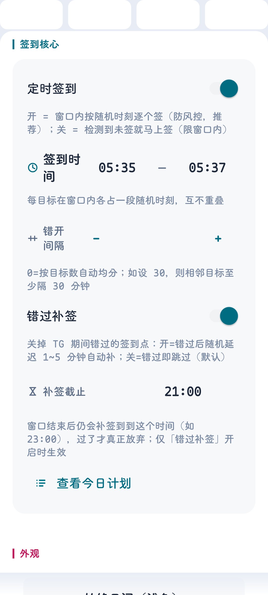

<div align="center">

<p align="center">
  <picture>
    <source media="(prefers-color-scheme: dark)" srcset="docs/banner-dark.svg">
    <source media="(prefers-color-scheme: light)" srcset="docs/banner-light.svg">
    
  </picture>
</p>

# TGAutoSign

<p align="center"><a href="https://github.com/wlmosv-png/TGAutoSign/blob/master/README.md">中文</a> · <b>English</b></p>

**Tap once. Signed every day.**

Tap the bot's check-in button in Telegram once — then never think about it again.
The control panel lives inside Telegram: send `/jmb` in any chat.

[](https://github.com/Xposed-Modules-Repo/io.github.wlmosv_png.tgautosign/releases/latest)
[](https://github.com/Xposed-Modules-Repo/io.github.wlmosv_png.tgautosign/releases/latest)
[](https://github.com/LSPosed/LSPlant)
[](LICENSE)
[](https://t.me/+V2Oyu8pSubs4ZjE0)

**[Download the latest APK](https://github.com/Xposed-Modules-Repo/io.github.wlmosv_png.tgautosign/releases/latest)** · [Source repo](https://github.com/wlmosv-png/TGAutoSign)

<sub>Download only from these two sources. For repacked builds elsewhere, compare the fingerprint below.</sub> · [Changelog](https://github.com/wlmosv-png/TGAutoSign/blob/master/CHANGELOG.md)

by **wlmosv** · if it's useful, [star the source repo](https://github.com/wlmosv-png/TGAutoSign)

</div>

---

### Local by design

<sub>No account credentials, no official API, no data leaving your device.</sub>

- The **only outbound call** is an update check every 12 hours — it can be disabled, and it carries no sign-in data
- Targets and signed-state live in Telegram's local storage; they **never leave the device**
- The module requests **no** storage, notification or install permissions; all automation happens on-device, with no relay server


<details>
<summary><b>Verify the build</b></summary>

<br>

Official signing certificate

```
SHA-256  AF:55:24:CD:55:4A:E6:ED:E3:EC:27:47:C7:BE:D1:59
         B0:9B:C4:F6:A4:32:44:A6:8B:46:22:E9:46:32:25:C8
SHA-1    58:A2:B4:D3:F2:83:9A:92:7A:D4:0C:23:51:FE:43:AB:6F:D3:FB:C3
```

Check it yourself

```sh
keytool -printcert -jarfile TGAutoSign-*.apk   # compare against the fingerprint above
sha256sum TGAutoSign-*.apk                     # compare against sha256sum.txt in the release
```

Exactly one class opens a connection — `update/UpdateChecker.java` — so you can audit it.
The fingerprint corresponds to the release key in use since September 2026; any key rotation will be announced in the release notes.

> ⚠️ **Risk notice** — any Telegram automation carries some risk of account restriction. This module uses client-side check-ins, randomised slots and backoff, and is deliberately gentle, but **makes no zero-risk claim**.

</details>

---

## Screenshots

<p align="center">
  <picture>
    <source media="(prefers-color-scheme: dark)" srcset="docs/hero-dark.png">
    <source media="(prefers-color-scheme: light)" srcset="docs/hero-light.png">
    
  </picture>
</p>

**Main panel** · **Targets** — exported by the module's own `/jmb shots`, not captured by hand; target names are replaced with placeholders.

**English UI** — built in on English devices, no setup required

Each page shown in dark / light

| Main panel · Dark | Main panel · Light |
| --- | --- |
|  |  |

| Targets · Dark | Targets · Light |
| --- | --- |
|  |  |

| Settings · Dark | Settings · Light |
| --- | --- |
|  |  |

## What it does

- **Tap once, it learns** — tap the bot's check-in button once and it replays daily, automatically. It keeps up even when the button's callback data changes.
- **Text commands too** — set a bot ID plus a command (e.g. `/checkin`) and it sends on schedule.
- **Group & channel check-ins** — group IDs are supported; replies are read from group messages.
- **Your schedule** — signing window · per-target random slots · minimum spacing · make-up deadline (23:00 by default) · pause a target for a week.
- **Rate-limit friendly** — on failure it backs off 5m → 15m → 45m → 2h → 4h, waits out `FLOOD_WAIT` exactly as the server asks, and catches up when the network returns.
- **Block what you don't want** — keyword / regex rules (matched against bot replies and button labels) · block a whole bot · freeze a single target. Network-learned hits wait for your confirmation.
- **Multi-account, fully isolated** — targets and signed-state are kept per account; targets can be copied across accounts.
- **Daily summary** — one message a day to your own Saved Messages (no system notifications); an extra alert after 3 consecutive failing days.
- **Cross-client sync** — the official client and third-party clients share targets and signed state.
- **Bilingual UI** — English out of the box on English devices; switchable in Settings.
- **Local by design** — no server, no telemetry; the update check is the only outbound call and can be disabled.

---

## Supported clients

The module matches by host package first, then falls back to flag-class capability — it only injects on a match.

<sub>**Requires** root + LSPosed (libxposed **API 102** or newer — see LSPosed Manager → Settings → About). **Not supported**: non-root devices, Telegram X, standalone server deployment.</sub>

| Client | Package | Status |
| --- | --- | --- |
| Telegram (Play / default) | `org.telegram.messenger` | ✅ tested on 12.10.4 |
| Telegram (direct APK) | `org.telegram.messenger.web` | ✅ statically verified |
| Nagram (NextAlone) | `xyz.nextalone.nagram` | ✅ tested on 12.10.3 |
| Nagram XF | `fork.risin42.nagramx` | ✅ tested (dec46b0) |
| ExteraLess (ExteraGram fork) | `com.exteraless.app` | ✅ tested on 12.10.1 |
| Nekogram | `tw.nekomimi.nekogram` | ✅ tested on 12.10.3 |
| Mercurygram | `it.belloworld.mercurygram` | ✅ tested on 12.10.3.1 |
| Nagram / NagramX / NagramNX | `nu.gpu.nagram` etc. | whitelisted, not tested |
| Other Telegram-Android forks | any | injects if flag classes are intact |
| Telegram X | — | ❌ not injected (different core) |

Adapted for the whole Telegram **12.10.x** line, including 12.10.4.

> ⚠️ **Scope**: LSPosed only enables the official client by default. If you use a third-party client, tick **that client** in the module's scope as well.

---

## 30-second setup

1. Install the APK → **LSPosed** → **Modules** → enable **TGAutoSign**
2. Tick your Telegram client under **Scope**
3. Fully stop Telegram, then reopen it
4. Send `/jmb` in any chat → go to the bot chat and **tap its check-in button once**

> Done — it signs daily from then on. Send `/jmb` anytime to check status or change settings.

---

## FAQ

**Tapped the button but nothing was added**

Check the auto-learn switch under Settings → Learning, or add the target manually via `/jmb` → Add target. If it still won't add, make sure the scope is ticked and fully restart Telegram.

**The bot uses buttons instead of text — does that work?**

Yes. Tapping once teaches it (the list shows a type badge) and it replays daily. Buttons that merely open a web page or a game (no callback data) are never mis-learned.

**It works on the official client but not my third-party one**

Those clients are supported (see the matrix above), but scope only includes the official client by default. Tick your client in LSPosed, then fully restart Telegram.

**Signing isn't working — what do I do?**

Run `/jmb` → **Self-check** to verify the reflection anchors, then check the built-in log view for injection and signing records. Still stuck? Export the log together with your client name and version, and open an issue.

**How do I migrate to a new phone or account?**

On the old device: `/jmb` → **Export**. On the new one, drop the json into `Android/data/<client package>/files/tgautosign/` and import it. Import merges — it never wipes.

**Update says "signature mismatch"**

You installed a debug build. Uninstall it, then install the official APK from this page. Official builds upgrade over each other in place, and your data is kept.

---

## 更新日志 · Changelog

### v1.6.2 (128) — 2026-09-29

**Fixed**: Symptom: targets whose button could not be tapped, and where the bot merely replied with a greeting… · Text commands were recorded as signed immediately, after which the bot's refusals were ignored. · Wrong attribution of expired buttons caused permanent retry abandonment. · Manual retry did not clear the expiry counter, so retries were quickly consumed. · The classification code collided with an existing field, losing the classification. · The fallback path did not record a classification, leaving the UI and log on the old state. · Replies matching no keyword left no classification, so the row stayed at "sent". · Progress messages were mistaken for sign-in results. · Returning to the home screen after using "Handle" from the notification banner. · Lenient mode counted functional refusals as success.

**变更**: Execution-result classification replaces scattered verdict branches. · Pending actions moved to a top summary bar. · Entries can be told apart in the list and the log. · Button-nature filtering removed in favour of "learn whatever you tap". · Status wording returned to plain language.

### v1.6.1 (124) — 2026-09-28

**Fixed**: Targets multiplied automatically: the module's own callbacks were misread as user learning. · Sent-state rollback caused duplicate sign-ins. · Non-check-in buttons entered the learning scope. · Incorrect account attribution in network-layer learning. · Account index clamping was too broad. · Disabled accounts still performed sign-ins. · Batch sign-in re-sent targets already signed. · The account overview omitted accounts on non-contiguous slots. · Buttons clearly labelled as check-ins were blocked (regression introduced in the previous build).

**New**: Two more supported clients, and a corrected default scope. · Cleanup logging for mislearned entries.

**Tooling**: README changelog generator supports block-style bilingual entries. · New build gate: README changelog must stay in sync. · Pure-logic unit tests grew from 174 to 297.

[Full changelog →](https://github.com/wlmosv-png/TGAutoSign/blob/master/CHANGELOG.md)
## License

Licensed under **GPLv3**. For personal use with your own accounts.
Please respect Telegram's Terms of Service and each group's / bot's rules.

---

<p align="center"><sub>Made by wlmosv · <a href="https://github.com/wlmosv-png/TGAutoSign">a star keeps it going</a></sub></p>
