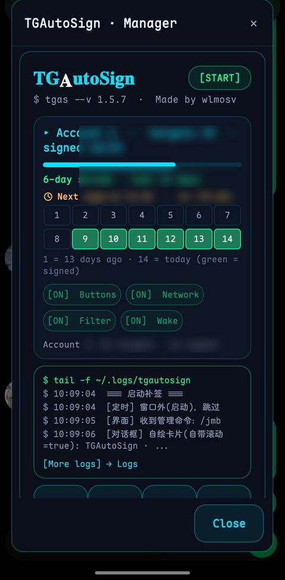
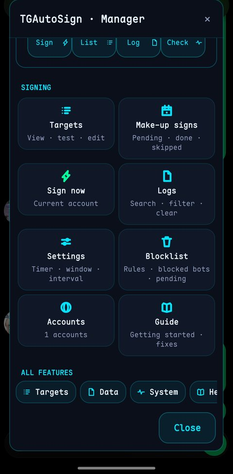
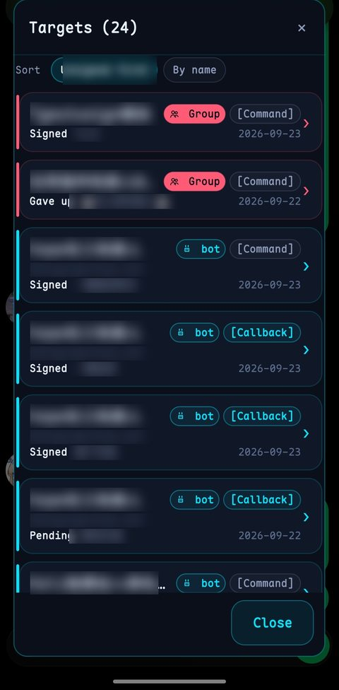
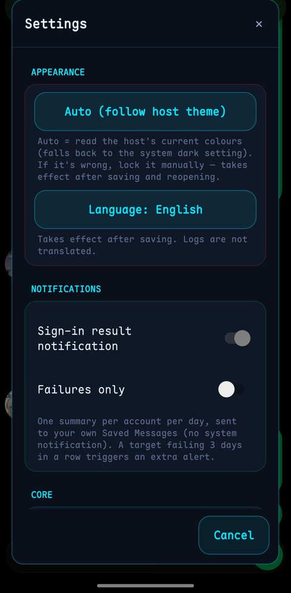
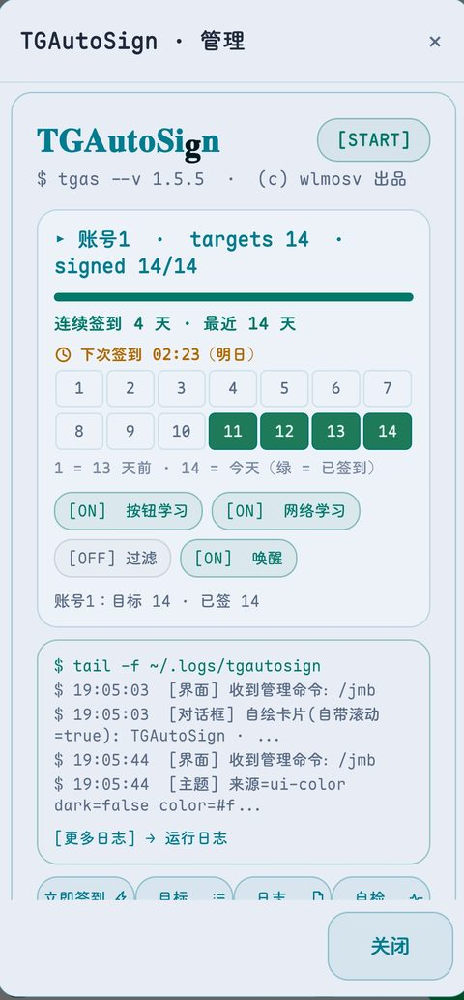
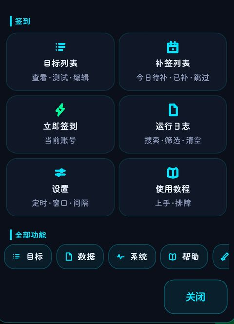
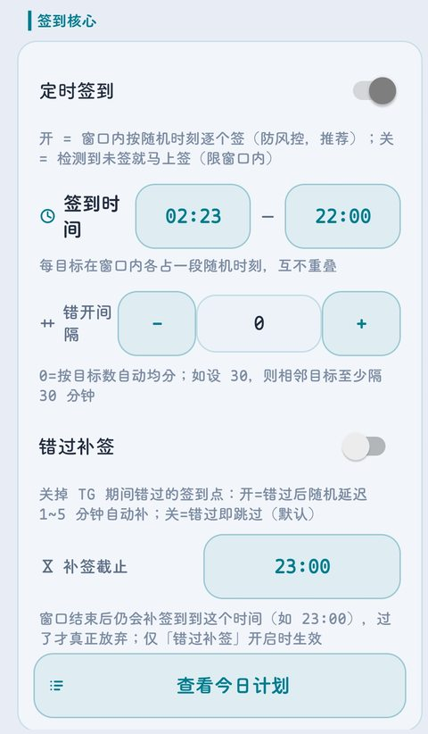

# TGAutoSign · Telegram 自动签到

[](https://github.com/wlmosv-png/TGAutoSign/releases/latest)
[](https://github.com/wlmosv-png/TGAutoSign/releases)
[](https://github.com/LSPosed/LSPlant)
[](LICENSE)
[](https://github.com/wlmosv-png/TGAutoSign/actions)

**每天手动给签到 bot 发指令？让模块替你签。**

在 Telegram 里点一次签到按钮就学会，之后每天自动：回调按钮重放、断网补签、限流退避、面板实时跟踪。
管理界面直接做进 Telegram —— 任意聊天发 `/jmb`，没有独立 App。

⬇️ **[下载最新版 APK](https://github.com/Xposed-Modules-Repo/io.github.wlmosv_png.tgautosign/releases/latest)** · [全部版本](https://github.com/wlmosv-png/TGAutoSign/releases) · [更新日志](CHANGELOG.md)
<details open>
<summary><b>🇬🇧 English</b></summary>

**TGAutoSign** — Telegram daily auto check-in for LSPosed.
Tap the bot's check-in button **once**; it learns and repeats daily, automatically.
The control panel lives inside Telegram: send `/jmb` in any chat.

**Highlights**

- **Three ways to sign** — callback buttons · text commands · group/channel check-ins; one bot can hold several commands
- **Multi-account**, fully isolated (targets, signed state and retry backoff are per account)
- **Timing** — signing window · per-target schedule · minimum spacing · make-up deadline (23:00 default) · pause a target for a week
- **Reliability** — three-state reply parsing (success / already signed / failure) · failure rolls back and retries with backoff 5m → 15m → 45m → 2h → 4h · `FLOOD_WAIT` respected · offline make-up · 3-day failure alert · cross-client sync
- **Blocking** — line-based rules (matched against bot replies and button labels, `/…/` regex supported) · block a whole bot · freeze one target · network-learn hits need your confirmation
- **UI & data** — panel inside Telegram, all icons drawn in code, dark/light follows your Telegram theme, built-in log view with a one-tap diagnostic bundle, daily summary to your Saved Messages
- **100% local** — no server, no telemetry
- **English UI out of the box** — on English devices no setup is needed

**Supported clients**

| Client | Package | Status |
| --- | --- | --- |
| Telegram (Play / default) | `org.telegram.messenger` | ✅ tested on 12.10.3 |
| Telegram (direct APK) | `org.telegram.messenger.web` | ✅ statically verified |
| Nagram XF | `fork.risin42.nagramx` | ✅ tested |
| ExteraLess (ExteraGram fork) | `com.exteraless.app` | ✅ tested on 12.10.1 |
| Nagram / NagramX / NagramNX | `nu.gpu.nagram` etc. | whitelisted, not tested |
| Other Telegram-Android forks | any | injects if flag classes are intact |
| Telegram X | — | ❌ not injected (different core) |

> ⚠️ **Scope**: LSPosed enables only the official client by default. Using a third-party client? Tick **that** client in the module's scope as well.

**Install** — install the APK → enable in LSPosed → tick your Telegram client in scope → fully stop Telegram, reopen → send `/jmb` in any chat.
Requires **libxposed API 102+** and a rooted device.

**What this is not** — a convenience tool, not a bypass. It respects rate limits, waits out `FLOOD_WAIT`, backs off on failures, and never loops tightly. No exploit, no anti-detection logic.

</details>

---

## 📱 Screenshots / 界面一览

**English UI** — built in, no setup required
**英文界面** — 内置，无需设置

| Main panel | Main menu |
| --- | --- |
|  |  |
| Targets | Settings |
|  |  |

<details>
<summary>中文界面（3 张）</summary>

| 暗色 · 主面板 | 暗色 · 主菜单 |
| --- | --- |
|  |  |
| 设置 | |
|  | |

</details>

---

## 🚀 快速开始

1. **安装**：[下载最新版 APK](https://github.com/Xposed-Modules-Repo/io.github.wlmosv_png.tgautosign/releases/latest)，在 **LSPosed** 中启用，作用域勾选你的 Telegram 客户端
2. **完全停止** Telegram 后重新打开
3. 到签到 bot 的会话里**点一次签到按钮** → 模块自动记住目标
4. 之后每天自动签到；发 `/jmb` 可随时查看与管理

> 回调按钮型 bot（点按钮不发文字）同样支持：点一次即学习，之后每天自动重放。

---

## ✨ 功能

**签到方式**

- 回调按钮：点一次即学会，之后每天自动重放。按钮 data 每次变化也跟得上
- 文本指令：填 bot ID + 指令，到点自动发
- 群 / 频道：群 ID 支持签到与回复判定，列表显示群名或备注名
- 一个 bot 多条指令：各自独立签到、独立状态、独立重试
- 多账号：目标、已签状态、重试退避按账号隔离；可跨账号复制目标

**时间控制**

- 签到窗口：只在窗口内动作，窗口外零请求
- 时刻表：窗口按目标数均分，各目标取随机时刻、互不重叠
- 错开间隔：设 N 分钟则相邻目标至少隔 N 分钟再随机
- 补签截止：窗口结束后仍补到该时刻（默认 23:00），当天不作废
- 暂停：单个目标暂停一周，到期自动恢复

**可靠性**

- 回复三态判定：成功 / 已签过 / 失败。失败撤销已签，按 5m→15m→45m→2h→4h 退避
- FLOOD_WAIT 尊重服务器给的等待秒数
- 断网补签：启动 / 定时 / 打开聊天 / 网络恢复
- 连续失败 3 天告警一次，签到成功即清零
- 跨客户端同步：官方版与第三方客户端之间同步目标与状态，任一端签的都算数

**过滤与排除**

- 排除规则：一行一条，命中 bot 回复正文或按钮文案就不自动学习；支持 `/…/` 正则与 `#` 注释
- 排除的 bot：整只 bot 不学习、不自动签到；在主菜单「排除管理」里随时增删，已排除条目独立分组显示
- 目标冻结：永久停签某条目，与「暂停一周」区分
- 网络学习需确认：新目标先进待确认池，手动点「加入」才真正添加，防验证码类 bot 误加
- 目标备注名：可自己给 bot 起名（如「每日签到」），列表按 `@username` 辅助识别，不裸露数字 ID

**界面与数据**

- 管理界面在 Telegram 内，无独立 App；面板底部「全部功能」分类直达
- 图标全部代码绘制（`Icons.java`），含机器人等矢量图标，不依赖系统 emoji，各机型一致
- 深浅色跟随 TG 主题，也可强制日间 / 夜间
- 运行日志：五级配色、最新在上、按目标筛选、一键诊断包；按天切分落盘（512KB × 7 天）
- 通知：每天一条摘要发到自己的收藏夹，不弹系统通知
- 全部本地存储，无服务器、无遥测

---

## 🖥️ 支持矩阵

| 客户端 | 包名 | 状态 |
| --- | --- | --- |
| Telegram（Play / 默认渠道） | `org.telegram.messenger` | ✅ 12.10.3 回调签到实测 |
| Telegram（官网直连版） | `org.telegram.messenger.web` | ✅ 静态逐项核对 |
| Nagram XF | `fork.risin42.nagramx` | ✅ dec46b0 实测 |
| ExteraLess（ExteraGram fork） | `com.exteraless.app` | ✅ 12.10.1-feae791 实测 |
| Nagram / NagramX / NagramNX | `nu.gpu.nagram` 等 | 白名单覆盖，未实测 |
| 其它 Telegram-Android 系 fork | 任意包名 | 标志类齐全即注入 |
| Telegram X | — | ❌ 不注入（换内核） |

适配 Telegram **12.10.x** 全系。

> ⚠️ 作用域：LSPosed 里默认只勾了官方版，用第三方客户端请手动把对应客户端勾进模块作用域。

---

## 🧱 代码结构

| 文件 | 职责 |
| --- | --- |
| `TGAutoSignEntry.java` | Xposed 入口：hook 装配、宿主判定、作用域申请 |
| `TGAutoSignCore.java` | 主逻辑：签到调度、面板采集、回复判定、管理界面、日志、同步 |
| `Hosts.java` | 宿主白名单与标志类能力探测 |
| `Theme.java` | 终端风色板与深浅色判定（采样界面真实颜色，宿主无关） |
| `Icons.java` | 矢量图标集：24×24 网格、`Canvas`+`Path` 代码绘制，不占资源文件 |
| `Art.java` | 标题字符美化（数学粗体 / 花体） |
| `update/UpdateChecker.java` | 检查更新：读 GitHub Releases latest，两跳容灾 |
| `update/ConfigStore.java` | 配置导出 / 导入 |

**宿主适配说明**：模块通过反射调用宿主 API，并 hook 以下锚点 —— `ConnectionsManager.sendRequest`（发送与判定）、`ChatActivityEnterView` 的按钮点击方法（按钮学习）、`LaunchActivity.onResume`（启动补签）、`MessagesController.processUpdate*`（面板采集与回复语义）。

按钮点击方法自 TG 12.10.3 起与 `AlertDialog$Builder` 的 setter 一样被方法名混淆（官方版 `didPressedBotButton` → `g`，Nagram → `f` / `h`）。模块改为**按参数类型结构匹配**定位并 hook，不依赖具体方法名，官方版与各 fork 通用。

Telegram 12.10.3 起 `AlertDialog$Builder` 的 setter 被方法名混淆（`setTitle` → `g` 等），模块的对话框已改为自绘实现，不再依赖该 API。

---

## 🛠️ 构建

标准 Gradle + AGP：

```sh
./gradlew :app:assembleRelease
```

正式包使用 release keystore 签名；同一份 APK 同时发布到本仓库与 [Xposed-Modules-Repo 模块仓库](https://github.com/Xposed-Modules-Repo/io.github.wlmosv_png.tgautosign)。

---

## ❓ 常见问题

**Q：回调按钮型 bot 怎么学？**

A：`/jmb` → 添加目标 → 捕获回调按钮 → 去 bot 会话点一次签到按钮 → 面板列出按钮后点选绑定。之后每天自动重放。

**Q：签到没生效？**

A：`/jmb` → 自诊断看反射锚点；运行日志查注入与签到记录；仍未解决就导出运行日志，附客户端名称与版本提 [Issue](https://github.com/wlmosv-png/TGAutoSign/issues)。

**Q：换手机 / 换账号怎么迁移？**

A：旧环境 `/jmb` → 导出配置；新环境把 json 放进 `Android/data/<客户端包名>/files/tgautosign/` 后导入。导入只合并不清空。

---

## 📜 更新日志

### v1.5.6 (119)

**新增**：三层黑名单（排除规则 / 排除的 bot / 目标冻结）· 排除管理独立入口 · 网络学习需确认 · 目标备注名 + @username · bot 矢量图标

**界面**：冻结 / 已排除 徽章标识，已排除条目虚化 · 对话框不再叠层

**修复**：官方版 / Nagram 按钮学习失效（改结构匹配 hook）· 回调签到前置命令后盲等导致面板过期 · 网络层学习 hash 字段崩溃 · 汇总通知提前发送

**兼容**：按钮点击方法按参数类型结构匹配，官方版与各 fork 通用 · 三客户端回调签到实测通过

> 自本版起仅对 `org.telegram.messenger`、`xyz.nextalone.nagram`、`com.exteraless.app` 三个客户端做主要维护。

### v1.5.5 (118)

**新增**：群 / 频道签到 · 签到结果通知（收藏夹）· 跨客户端同步 · 补签截止 · 连续失败告警

**界面**：图标全面矢量化为代码绘制 · 主菜单分类直达 · 教程重写 · 日志页固定最新在上 · 诊断包升级 · 自绘对话框三宿主统一

**修复**：手动发指令被误判为已签 · bot 回「已签过」不落盘 · 群签到收不到判定 · 日志读不到历史 · 日志「回到最新」方向相反 · 定时器重复排队

**兼容**：适配 TG 12.10.3 的 `AlertDialog$Builder` 方法名混淆 · 主题判定修复 Nagram / ExteraLess

### v1.5.4 (117)

- 定时签到体系：只在窗口内签，时刻表按目标均分，错开间隔可配
- 今日计划：每目标显示已签 / 待签时刻
- 日志升级：按目标过滤、诊断包、加载更多、配色重做
- 界面：自绘终端卡片对话框、设置页分组、下次签到倒计时

完整变更见 [CHANGELOG.md](CHANGELOG.md)。

## ⚖️ License

**GPLv3**，仅供个人学习与自有账号使用；请遵守 Telegram 服务条款及各群组 / 机器人规则。
