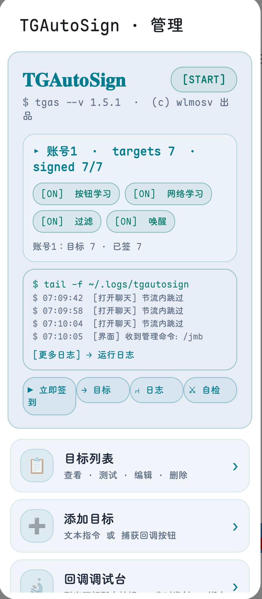
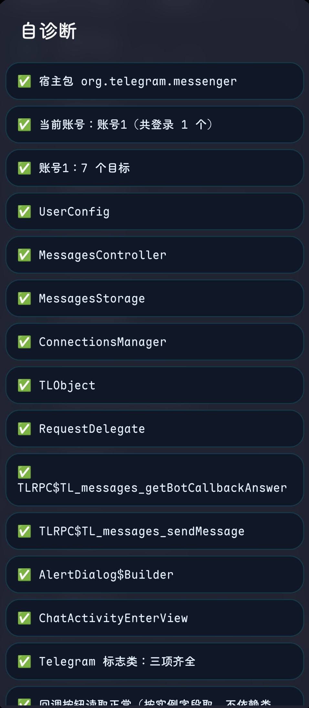
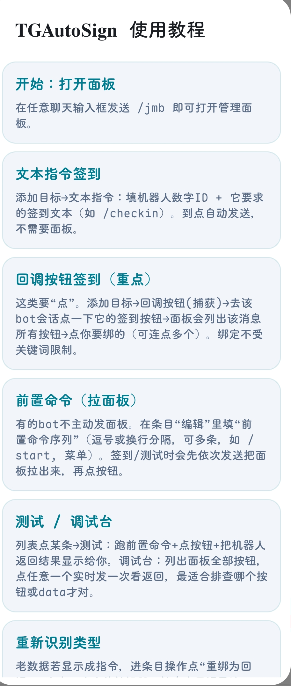

# TGAutoSign · Telegram 自动签到

**每天手动给签到 bot 发指令？让模块替你签。**

点一次学会，之后每天全自动：回调按钮签到、断网自动补、多账号隔离、限流退避、面板实时跟踪，全部内置。管理界面直接做进 Telegram——任意聊天发 `/jmb` 弹出菜单，没有独立 App、没有桌面组件。

⬇️ **[下载最新版 APK](https://github.com/Xposed-Modules-Repo/io.github.wlmosv_png.tgautosign/releases/latest)** · [全部版本](https://github.com/wlmosv-png/TGAutoSign/releases) · [更新日志](CHANGELOG.md)

---

## 📱 界面一览

| 暗色 · 主面板 | 日间 · 主面板 |
| --- | --- |
|  |  |
| 自诊断 | 使用教程 |
|  |  |

---

## 🚀 快速开始（30 秒）

1. **安装**：[下载最新版 APK](https://github.com/Xposed-Modules-Repo/io.github.wlmosv_png.tgautosign/releases/latest)（模块本体），在 **LSPosed** 中启用，作用域勾选你的 Telegram 客户端
2. **完全停止** Telegram 后重新打开
3. 任意聊天发送 `/jmb` 打开管理面板
4. 到签到 bot 的聊天里**点一次签到按钮** → 模块自动记住目标，之后每天自动替你签到

> 回调按钮型 bot（点按钮不发文字）同样支持：点一次即学习，之后每天自动重放回调。

---

## ✨ 功能总览

**签到核心**
- 点一次签到按钮即学会目标；可限定仅命中关键词才自动加，防误加
- 每天每账号只签一次；断网后自动补签（启动 / 定时 / 打开聊天 / 网络恢复）
- Bot 回复语义三态判定：成功 / 已签过 / 失败，失败自动撤销已签并按 5m→15m→45m→2h→4h 指数退避重试
- 限流 420 / FLOOD_WAIT 尊重服务器给出的等待秒数

**签到窗口（v1.5.2）**
- 设置可配每日签到窗口（如 08:00-10:00），窗口外不签、窗口内准点补签；秒级排程 + 随机偏移防风控

**连续签到日历（v1.5.2）**
- 首页显示连续签到天数 + 最近 14 天打卡格子，断签归零，旧数据自动兼容

**预设模板（v1.5.2）**
- 主菜单「📚 预设模板」常用签到指令一键添加

**界面体验（v1.5.3）**
- 主菜单分 5 组（核心/工具/数据/系统/维护），高频置顶、危险操作沉底；目标列表三列对齐 + 状态色 + 未签置顶排序
- 标题动效轮换（霓虹呼吸 / 逐字波浪 / RGB 流光 / 键盘敲击）；面板开启动效与按压反馈；15 秒内重复打开秒开

**回调按钮签到（Live Panel 引擎，v1.5.0 重写）**
- 实时跟踪 bot 最新面板，重放前按「data 精确 > 文本一致 > 最近点击」自适应匹配；data 每次变化的 bot 同样跟随
- 协议级修复：`getBotCallbackAnswer` 请求与官方客户端一致，不再 DATA_INVALID
- 一次性按钮自愈：按钮被点废时自动拉新面板重试
- 每条目标可带前置命令序列（`/start` 等模板一键添加），签到前先拉面板再重放
- 🧪 测试 / 🔬 调试台：点任意按钮即时发一次并显示机器人返回

**稳定性与防滥用**
- 签到动作 300–1200ms 随机间隔；单账号每日动作上限（默认 60 可调）
- 目标可暂停一周（⏸）；面板过期时给出明确修复指引

**多账号**
- 学习目标、已签状态、重试退避全部按账号隔离
- 🌐 签全部账号逐账号汇报；📋 复制目标到其它账号一键同步

**多客户端（v1.2.2+）**
- 官方 Play 版、官网直连版、Nagram XF 等 Telegram-Android 系客户端均可注入（见下方支持矩阵）
- 宿主判定 = 已知包名白名单 + 标志类能力探测；Telegram X 等换内核客户端明确不注入、不误伤

**管理体验（v1.5.0 界面）**
- 终端风界面：等宽字体、霓虹描边、`[ON]/[OFF]` 状态徽章
- 主界面实时日志卡（tail -f：面板开着每 4 秒自动刷新）
- 快捷命令行：▶ 立即签到 / → 目标 / ⏁ 日志 / ⚔ 自检；`/jmb log` 一键复制日志
- 五级运行日志（搜索 / 筛选 / 复制 / 清空，落盘自动轮转）

**内置更新与迁移**
- 启动静默检查更新（12 小时冷却），`/jmb update` 强制检查，一键下载到系统「下载」目录
- 配置导出 / 导入（json，导入只合并）；日志导出 txt
- 旧版本数据自动迁移，覆盖安装不丢签到记录

**纯本地**：无服务器、无遥测，数据仅存于本机 SharedPreferences。

---

## 🖥️ 支持矩阵

| 客户端 | 包名 | 状态 |
| --- | --- | --- |
| Telegram（Play / 默认渠道） | `org.telegram.messenger` | ✅ 长期实测 |
| Telegram（官网直连版） | `org.telegram.messenger.web` | ✅ 静态逐项核对 |
| Nagram XF | `fork.risin42.nagramx` | ✅ dec46b0 实测 · 30dcd6c 构建暂不兼容 |
| ExteraLess（ExteraGram fork） | `com.exteraless.app` | ✅ 12.10.1-feae791 实测 |
| Nagram / NagramX / NagramNX | `nu.gpu.nagram` 等 | 白名单覆盖，未实测 |
| 其它 Telegram-Android 系 fork | 任意包名 | 标志类能力探测，齐全即注入 |
| Telegram X | — | ❌ 不注入（换内核，标志类不齐全） |

> ⚠️ 作用域：LSPosed 里默认只勾了官方版，用第三方客户端请手动把对应客户端勾进模块作用域。

---

## ❓ FAQ

**Q：回调按钮型 bot 怎么学？**
A：发 `/jmb` → ➕ 添加目标 → 🔘 捕获回调按钮 → 去 bot 会话点一次它的签到按钮 → 面板列出按钮后点选绑定（可连点多个）。之后每天自动重放。

**Q：签到没生效怎么办？**
A：`/jmb` → 🩺 自诊断看反射锚点是否正常；📄 运行日志查注入与签到记录；再不行用 🧾 导出运行日志 + 客户端版本提 Issue。

**Q：换手机 / 换账号怎么迁移？**
A：旧环境 `/jmb → 📤 导出配置`，新环境把 json 放进 `Android/data/org.telegram.messenger/files/tgautosign/` 后 `/jmb → 📥 导入配置`。

---

## 📜 更新日志

### v1.5.3 (116) —— 界面重排 + 日历回填 + 标题动效

- 🐛 **修复**：自动签到后日历不绿（漏记签到记录，已回填历史）；子界面叠层/闪烁（恢复单窗口导航）；快速重开光标卡死
- 🎨 **界面重排**：主菜单分 5 组（核心/工具/数据/系统/维护）；目标列表三列对齐 + 状态色；未签置顶/按名称排序
- ✨ **标题动效**：霓虹呼吸 / 逐字波浪 / RGB 流光 / 键盘敲击，每次打开轮换
- 📣 **加入群组**：主菜单一键跳 TG 交流群
- 🔌 宿主新增 NextAlone Nagram；Nagram XF 30dcd6c 构建自动跳过注入

### v1.5.2 (115) —— 签到时间窗 + 连续签到日历 + 界面体验升级

- 🕐 **每日签到窗口**：设置可配（如 08:00-10:00），窗口外跳过、窗口内准点补签，秒级排程 + 随机偏移防风控
- 📅 **连续签到日历**：最近 14 天打卡格子 + 连续天数，旧记录自动兼容
- 📚 **预设模板**：常用签到指令一键添加（bot ID 可改）
- ✨ **界面体验升级**：面板开启动效、标题字符动态、按压反馈、双排菜单；15 秒内重复打开秒开
- 🔌 兼容 Telegram 12.10.3；新增 ExteraLess 支持

完整变更见 [CHANGELOG.md](CHANGELOG.md)。

## ⚖️ License

**GPLv3**，仅供个人学习与自有账号使用；请遵守 Telegram 服务条款及各群组 / 机器人规则。

构建：标准 Gradle + AGP（`./gradlew :app:assembleRelease`），正式包使用 release keystore 签名，同一份 APK 同时发布到本仓库与 [Xposed-Modules-Repo 模块仓库](https://github.com/Xposed-Modules-Repo/io.github.wlmosv_png.tgautosign)。
